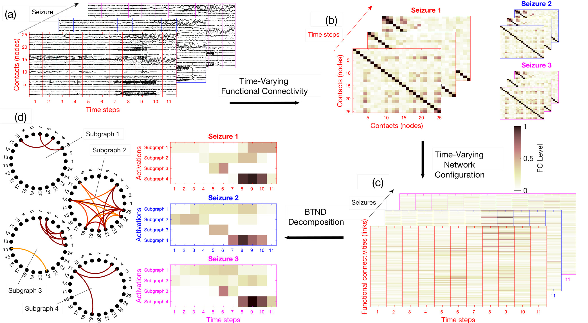
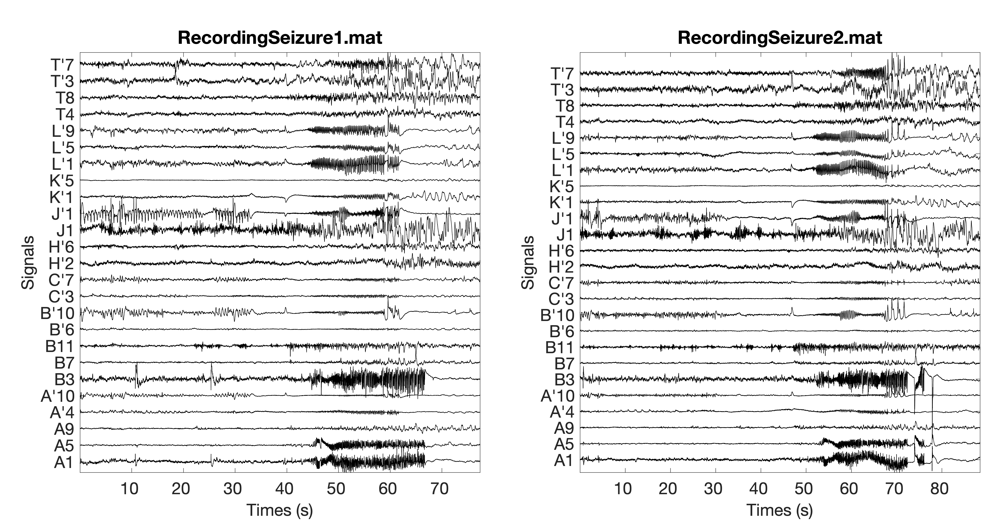

[Github-page](https://frusquegaetan.github.io/BTND/): https://frusquegaetan.github.io/BTND/

____
____
# Associated publication #

Codes from the article : \
 **Semi-automatic extraction of functional dynamic networks describing patient's epileptic seizures** [[pdf]](../Support/fneur-11-579725.pdf) [[frontiers]](https://www.frontiersin.org/articles/10.3389/fneur.2020.579725/full)\
Gaëtan Frusque, Pierre Borgnat, Paulo Gonçalves, Julien Jung, 
Frontiers in Neurology, 09-2020

# Overview of the codes provided #
[BTNDmain.m](./BRNDmain.m): Main file, divided in two part. First, an exemple using functional connectivity (FC) data from 3 seizures of a patient with:

* [DataFC.mat](./DataFC.mat): The FC matrix of the 3 seizures (DataFC{i} is the FC matrix from the seizure i).

* [NameCoordinate.mat](./NameCoordinate.mat.mat): Name of the electrodes indicating their positions in the brain (used to visualise the result).

Then, a second part explains how to apply the code with your dataset (see also section "Description of the method").

[FC_dynamic.m](./FC_dynamic.m): Compute a time-varying network for each seizure with a FC measure. The arguments are **Signal** the list of seizure recordings; **method** the FC mesures used (Pearson correlation, Phase Locking Value or Amplitude Envelope Correlation); **Freq** the sampling frequency; **TimeSegment** the size of the temporal segments (in s) used to compute a FC graph; **Step** a graph is computed at every 'Step' second. 

[BTND.m](./BRND.m): Decompose the time-varying network using the criteria (3) from the article. The arguments are **X** the time-varying network represented as a list of FC matrices; **K** number of subgraph wanted; **[lambda,gamma,eta]** the three parameters of the BTND; **init** number of different initialisations.

The output of the BTND are **F** containing the K subgraphs (in the columns of the matrix); **V** containing the activation profile of each subgraph specific to each seizures (V{i} activation profiles related to the seizure i); **cost** cost function values at each iteration of the algorithm. 

The BTND is solved by alternating two steps :

* [BTND_LassoRegression.m](./BTND_LassoRegression.m): Compute the matrix F knowing matrices V{1}, V{2}, ..., V{N} by performing a lasso regression.

* [BTND_FusedRegression.m](./BTND_FusedRegression.m): Compute matrices V{1}, V{2}, ..., V{N} knowing F by performing a regression under Fused lasso constraints. The projection on the Fused lasso constraint is done using algorithm [TV_Condat_v2.m](./TV_Condat_v2.m) from the website of [Laurent Condat](https://lcondat.github.io/).

[DISPLAY_graphcreate.m](./DISPLAY_graphcreate.m): Tool to visualise the matrix F as K circular graphs.

# Desciption of the method #

We describe here our novel semi-automatic method to characterise the dynamic epileptogenic network quantitatively and across time using SEEG signals.

## Overview ##

For each patient, the dataset is composed of several SEEG recordings for different seizures. Seizures can have different durations. The proposed strategy can be summarised in four steps:\
   (a) We chop each recording into short segments,  \
   (b) For each segment, we estimate via FC measures, the connectivity for each pair of electrode contacts. \
   (c) We rearrange the FC measures into a list of matrices representing the time evolution of FC for each seizure of a patient. \
   (d) The list of matrices representing the multi-seizures brain-wide time-varying network is decomposed into FC subgraphs characteristic of one patient but common to all his seizures, along with their activation profile specific to each seizure.  
The main steps of the method are illustrated in the figure 1 of the paper:

We provide now the code to perform all the steps presented in this figure.

## 1 - Get the data ##

In order to use the BTND pipeline, the dataset have to be arranged as a list of reccording (as illustrated in the figure 1.(a) of the paper). 

Considering as an example two recordings named "RecordingSeizure1.mat" and "RecordingSeizure2.mat" illustrated here:

Then a variable **Signal** have to be created with : 

* **Signal{1}** = RecordingSeizure1
* **Signal{2}** = RecordingSeizure2

Notice the recordings have to be already filtered in a bandwidth of interest. 

## 2 - Time-varying network inference ##

Now we compute a time-varying network for each seizure in the variable **Signal** with a FC measure. The multi-seizures time-varying network is represented as a list of FC matrices noted by the variable **X**.

The function [FC_dynamic.m](./FC_dynamic.m) directly entail the transition from the step figure 1.(a) to 1.(c) of the paper. It performs as the same time the time varying functional connectivity computation and the reconfiguration as a list of FC matrices. We have :

* **X** = FC_dynamic(**Signal**, **method**, **Freq**, **TimeSegment**, **Step**);

Three measure of FC are already implemented to construct the networks. Use as argument **method** = 'PLV' for the Phase Locking Value (FC measure used in the paper), **method** = 'COR' for the Pearson correlation and **method** = 'AEC' for the amplitude envelope correlation.

Argument **Freq** corresponds to the sampling frequency of the recordings. Arguments **TimeSegment** and **Step** are the main parameters to infer the dynamical network: A graph is computed at eavery **Step** seconds using a rectangular window of **TimeSegment** seconds. 

## 3 - BTND ##

We can now decompose the time-varying network represented by the variable **X** in K subgraphs with their corresponding activation profiles for each seizure.

The function [BTND.m](./BRND.m) entail the transition from the step figure 1.(c) to 1.(d) of the paper. Decomposing the time-varying network using the criteria (3) from the article. We have:

* [**F**, **V**] = BTND(**X**,**K**,[**lambda**,**gamma**,**eta**],**init**)

with **F** containing the **K** subgraphs (in the columns of the matrix) and **V** containing the activation profile of each subgraph specific to each seizures (V{i} activation profiles related to the seizure i). 

The differents argments are: 
* **K** the number of subgraphs wanted.
* **lambda**, **gamma** and **eta** the $$\lambda$$, $$\gamma$$ and $$\eta$$ parameters from the equation (3) of the paper. As presented in the supp material, considering $${\rm \mathsbf{X}} \in \mathbb{R}^{L \times T(s)}$$, then  $$\gamma_s = T(1)/T(S) \gamma$$ and $$\eta_s = T(1)/T(S) \eta$$. The parameters $$\gamma_s$$ and $$\eta_s$$ vary in function of the duration of the seizure.
* **init**: because the criteria (3) is non convex, different initialisations can lead to different solutions. we compute for **init** different initialisations a locales minimum of the criteria (3) and retain the best result

**Recommendations for the parameters selection:**  We recommend first to merge the sparsity parameters $$\lambda$$=$$\gamma$$. There is now two parameters to select: $$\lambda$$ and $$\eta$$. The user can play with these two parameters, we propose in [BTNDmain.m](./BRNDmain.m) a configuration that work well most of the time in our dataset $$\lambda$$=0.4 and $$\eta$$=0.2. In the paper, we fixed $$\eta$$=0.2 and selected the $$\lambda$$=0.4 according to a rule discribed in the [Supplementary Material](https://www.frontiersin.org/articles/10.3389/fneur.2020.579725/full#supplementary-material). We quickly describe the rule: considering the following score $$a_{\lambda} = \sum_{s=1}^{S} { \mid \mid  \mathbf{X}\{s\} - \mathbf{F} \mathbf{V}^t\{s\}  \mid \mid^2_F}$$. We consider the value of this score when $$\lambda$$=0 and $$\lambda=\infty$$ (corresponding to $$a_{\infty} = \sum_{s=1}^{S} { \mid \mid  \mathbf{X}\{s\} \mid \mid^2_F}$$.). The we are looking for a compromise between no regularisation and a too strong regularisation by looking for the value of $$\lambda$$ such as $${a_\lambda \approx 0.8(a_{\infty} - a_{0}) + a_{0}}$$.

select the parameter $$\lambda$$ such as 80% of the energy 

we select the parameter $\lambda$, such that $80\%$ of the information contained in the most faithful reconstruction is eliminated

## 4 - Visualisation ##

We propose at the end of the [BTNDmain.m](./BRNDmain.m) tools to visualise the **F** matrice as **K** circular graphs, and to represent the **V{s}** activation profiles. These represnetations are similar to the figure 2-5 of the paper.
